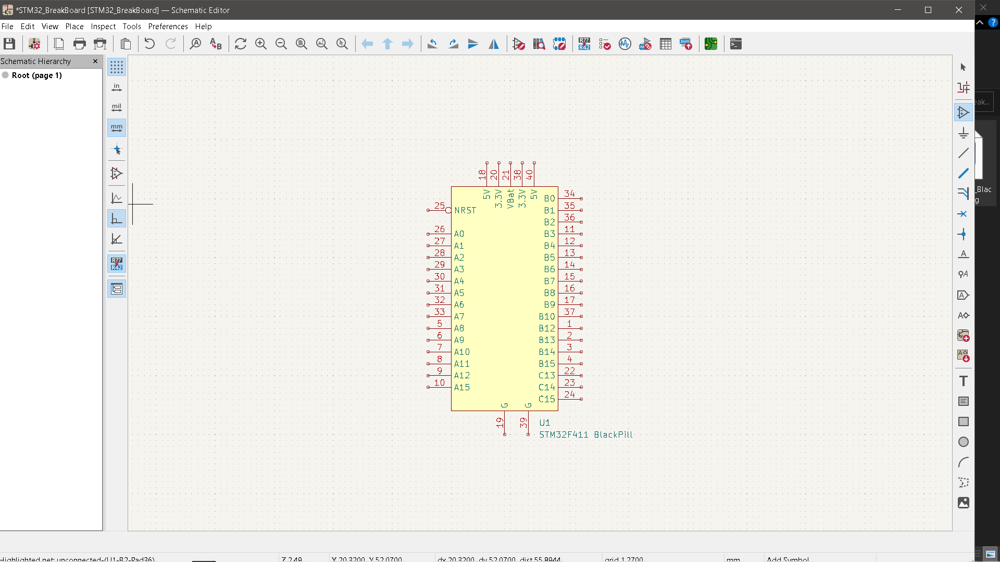
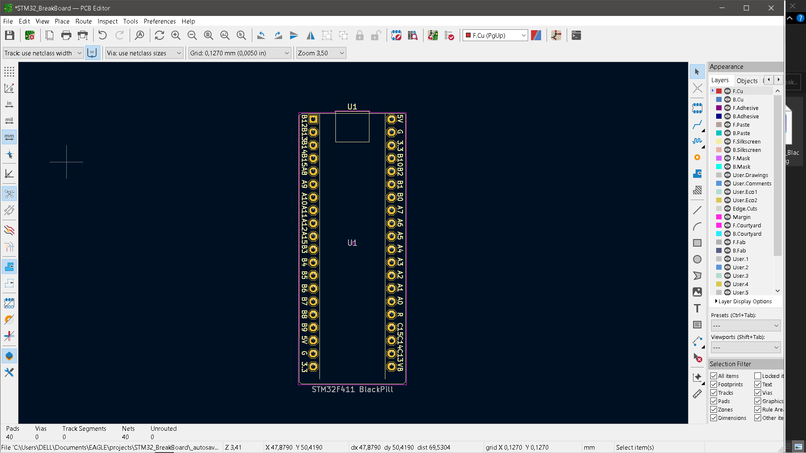

# KiCAD BlackPill F4xx library

KiCad Library for WeAct Black Pill V2.0 development board based on STM32F4xx.  

It gives you a single part that can be placed on a schematic/board so you can simply solder in or plug in an WeAct Black Pill V2.0 into your project.

## Install
1. Copy files to your favorite folder of your local PC.  
  `$ cd <YourPath>`  
  `$ git clone https://github.com/donys8/kicad-lib-WeAct-Black-Pill-V2.git`  
  or just  
  Download and place files (`STM32F411_Black_Pill.kicad_mod`, `WeAct_Black_Pill_V2.0.kicad_sym`)  
2. Symbol
  Open KiCAD's "Preferences"->"Manage Symbol Libraries"  
  Add line to "Global Libraries"  
  Nickname=WeAct_Black_Pill_V2.0, LibraryPath=<PathToYourFolder>/kicad-lib-WeAct-Black-Pill-V2/WeAct_Black_Pill_V2.0.kicad_sym, PluginType=Legacy

3. Footprint
  Open KiCAD's "Preference"->"Manage Footprint Libraries"  
  Add line to "Global Libraries"  
  Nickname=WeAct_Black_Pill_V2.0, LibraryPath=<PathToYourFolder>kicad-lib-WeAct-Black-Pill-V2/STM32F411_Black_Pill.kicad_mod, PluginType=KiCad

### Symbol
  

### Footprint
  

